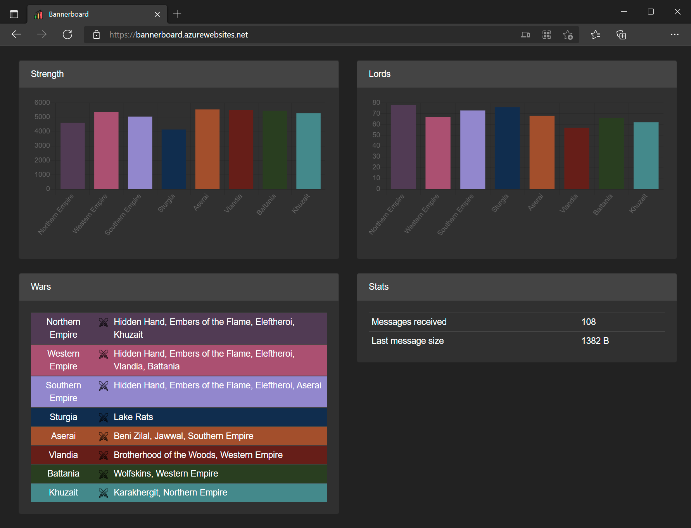

# Description

This is a mod for Mount &amp; Blade II: Bannerlord that lets you view game data in real time on a dashboard in a browser.

When the mod is loaded it sets up a local WebSocket server and pushes updates to connected clients.
The client is a Blazor WebAssemmbly app that runs in a browser and connects to the local WebSocket server and listens for updates.

No data is sent outside your system, the browser downloads the client code and runs it locally.

# Screenshots

The dashboard started out with two widgets for kingdom strength and kingdom lord count. The charts update every in-game hour.

More widgets are being added.

# Links

Download the mod from Nexus: https://www.nexusmods.com/mountandblade2bannerlord/mods/3386

Connect to your game: https://bannerboard.azurewebsites.net/

# Credits

Icons made by:

- [Freepik](https://www.flaticon.com/authors/freepik) from [Flaticon](https://www.flaticon.com/).
- [Game-icons.net](https://game-icons.net/)
