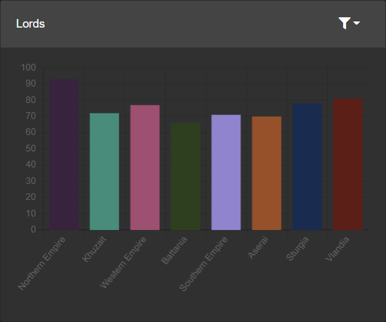
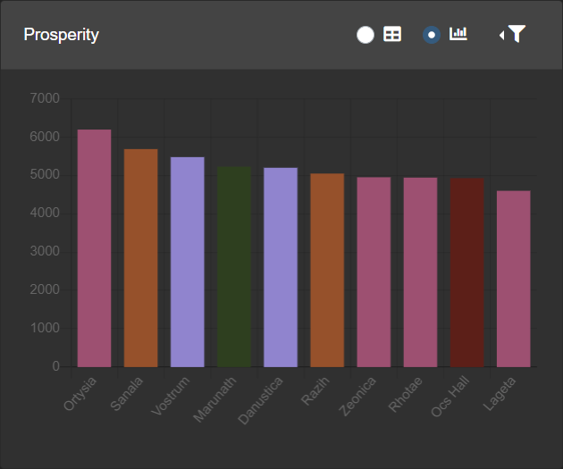

# Description

This is a mod for Mount &amp; Blade II: Bannerlord that lets you view game data in real time on a dashboard in a browser.

When the mod is loaded it sets up a local WebSocket server and pushes updates to connected clients.
The client is a Blazor WebAssembly app that runs in a browser and connects to the local WebSocket server and listens for updates.

No data is sent outside your system, the browser downloads the client code and runs it locally.

# Widgets

Widgets generally update every in-game hour. More widgets are being added.

## Strength

The strength widget displays kingdom strength as reported by the game API. The numbers are the same as displayed in the diplomacy tab in-game. This data can help you decide whether it's a good idea to attack someone. The kingdoms shown can be filtered.

## Lords

The lords widget displays the number of lords in each kingdom. This data is related to kingdom strength, but it can also help you find lords that might be tempted to switch allegiance. The kingdoms shown can be filtered.

## Wars

The wars widget shows which kingdoms are at war with each other. This can help you decide which kingdom to attack. The kingdoms shown can be filtered and it is also possible to show minor factions.

## Prosperity

The prosperity widget shows the top most prosperous cities. The chart view shows prosperity as reported by the game API and the table view also shows the number of militia and garrisoned troops. This data can help you decide which cities would be most profitable to conquer next. The number of top cities shown can be changed.

## Party

The party widget shows information about the player's party like the number and composition of troops and the amount of food available. The sections shown can be filtered.

## Heroes

The heroes widget lets you create a list of characters to keep track of, like highly skilled companions or enemy kings. The last known location will update whenever you visit a settlement, same as in-game. It is possible to turn on tracking for each character individually, which will track their last known location on the in-game campaign map.

## Stats

The statistics widget shows technical data about the mod and the dashboard. It also contains a button to reset the dashboard layout.

# Links

Download from Steam Workshop: https://steamcommunity.com/sharedfiles/filedetails/?id=2876851738

Download from Nexus: https://www.nexusmods.com/mountandblade2bannerlord/mods/3386

Connect to your game: https://www.bannerboard.net

# Developer links

Instructions for publishing the mod on Steam Workshop: https://moddocs.bannerlord.com/steam-workshop/uploading_updating_mod

# Credits

Icons made by:

- [Freepik](https://www.flaticon.com/authors/freepik) from [Flaticon](https://www.flaticon.com).
- [Game-icons.net](https://game-icons.net)